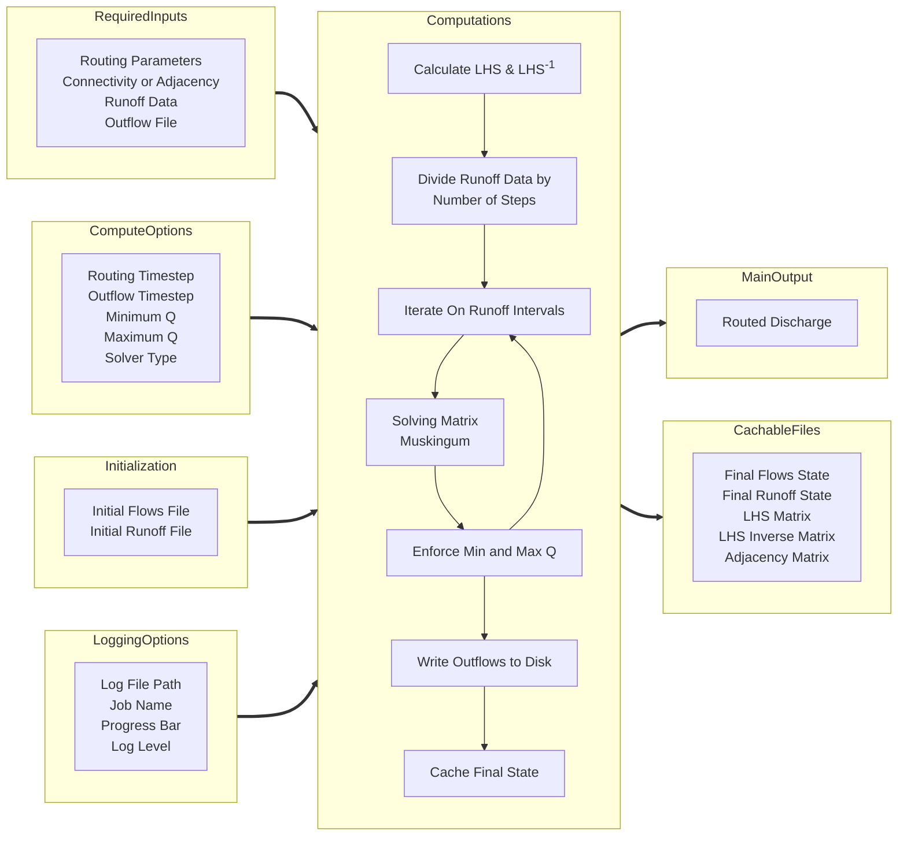

# River Route

`river-route` is a Python package for routing runoff through a river network. Routing calculations are vectorized with 
numpy and scipy which keeps the array computation times on par with faster compiled languages.

## Installation

Install river-route from source using conda/mamba such as with the following commands:

```bash
git clone https://github.com/rileyhales/river-route
cd river-route
mamba env create -f environment.yml
mamba activate rr
python setup.py install
```

## Quick Start Guide

You will need to prepare a configuration file for the routing computations, see the [Configuration File](#configuration-file) section for more details.

```python
import river_route as rr

(
    rr
    .Muskingum('/path/to/config.yml')
    .route()
)
```

Or you can provide all configuration parameters as keyword arguments such as with the following syntax:

```python
import river_route as rr
(
    rr
    .Muskingum(**{
        'routing_params_file': '/path/to/routing_params.parquet',
        'connectivity_file': '/path/to/connectivity.parquet',
        'runoff_file': '/path/to/runoff.nc',
        'outflow_file': '/path/to/outflow.nc',
    })
)
```

## Configuration File

The minimum required inputs in the configuration file are:

- `routing_params_file` - path to the [routing parameters file](#routing-parameters) (parquet)
- `connectivity_file` - path to the river network [connectivity file](#connectivity-file) (parquet)
- `runoff_file` - path to the prepared runoff data file (netCDF)
- `outflow_file` - path where the routed flows will be saved (netCDF)

It is recommended that you also provide these parameters:

- `lhs_file` - path where the LHS matrix will be cached (npz file). This parameter can be provided to future computations for a speed gain.
- `lhsinv_file` - path where the LHS inverse matrix will be cached (npz file). This parameter can be provided to future computations for a substantial speed gain.
- `adj_file` - path where the adjacency matrix will be cached (npz file). This parameter can be given instead of the connectivity file in future computations for a speed gain.

You can modify how the routing computations are performed with these parameters:

- `dt_routing` - an integer time in seconds for the routing time step. Will default to 300s or 5 minutes
- `dt_outflows` - an integer time in seconds for the outflow time step. Will default to the inflow time step
- `min_q` - a float for the minimum flow value enforced after each routing calculation.
- `max_q` - a float for the maximum flow value enforced after each routing calculation.

You can provide initial conditions/state and save final conditions/state with these parameters:

- `qinit_file` - path to the initial flows file (parquet). Defaults to 0.0 for all rivers.
- `rinit_file` - path to the initial runoff file (netCDF). Defaults to 0.0 for all rivers.
- `qfinal_file` - path where the final flows file will be saved (parquet). It will not be saved if a path is not provided.
- `rfinal_file` - path where the final runoff file will be saved (netCDF). It will not be saved if a path is not provided.

You can provide logging options with these parameters:

- `log_file` - path to a file where the log will be written. Defaults to stdout (logs not saved to file).
- `log_level` - the level of logging messages to be printed e.g. DEBUG, INFO. Defaults to INFO.
- `job_name` - a name for this job printed in logs and debug statements.
- `progress_bar` - display a computations progress bar in logs: True or False. Defaults to True.

A diagram of the possible configuration file parameters and their role in the routing computations is shown below.



| Parameter Name      | Required | Type      | Group                 | Description                                                        |                                                                                
|---------------------|----------|-----------|-----------------------|--------------------------------------------------------------------|
| routing_params_file | True     | File Path | Required Input        | Path to the routing parameters parquet file.                       |                                                
| connectivity_file   | True     | File Path | Required Input        | Path to the network connectivity parquet file.                     |                                              
| runoff_file         | True     | File Path | Required Input        | Path to the netCDF with runoff values to be routed.                |                                   
| outflow_file        | True     | File Path | Required Input        | Path where the outflows netCDF file should be saved.               |                                       
| dt_routing          | True     | Integer   | Compute Options       | Time interval in seconds between routing computations.             |                              
| dt_outflows         | False    | Integer   | Compute Options       | Time interval in seconds between writing flows to disc.            |
| min_q               | False    | Float     | Compute Options       | Minimum flow value enforced after each routing calculation         |
| max_q               | False    | Float     | Compute Options       | Maximum flow value enforced after each routing calculation         |
| solver_type         | False    | String    | Compute Options       | Method for solving routing equations: 'numerical' or 'analytical'. |
| qinit_file          | False    | File Path | Initialization Data   | Path to the initial flows file.                                    |                                                     
| rinit_file          | False    | File Path | Initialization Data   | Path to the initial runoff file.                                   |                                                    
| qfinal_file         | False    | File Path | Cachable State File   | Path where the final flows file should be saved.                   |                                    
| rfinal_file         | False    | File Path | Cachable State File   | Path where the final runoff file should be saved.                  |                                   
| lhs_file            | False    | File Path | Cachable Network File | Path where the LHS matrix should be cached.                        |                                         
| lhsinv_file         | False    | File Path | Cachable Network File | Path where the LHS inverse matrix should be cached.                |                                 
| adj_file            | False    | File Path | Cachable Network File | Path where the adjacency matrix should be cached.                  |                                   
| log_file            | False    | File Path | Logging Options       | Path to a file where the log will be written.                      |                                       
| job_name            | False    | String    | Logging Options       | A name for this job printed in logs and debug statements.          |                           
| log_level           | False    | String    | Logging Options       | The level of logging messages to be printed e.g. DEBUG, INFO       |
| progress_bar        | False    | Boolean   | Logging Options       | Display a computations progress bar in logs: true or false.        | 

## Input File Schema

### Routing Parameters

The routing parameters file is a parquet file with 3 columns and 1 row per river in the watershed. The index is ignored
index.

| Column | Data Type | Description                                                               |
|--------|-----------|---------------------------------------------------------------------------|
| rivid  | integer   | Unique ID of a river segment                                              |
| k      | float     | the k parameter of the Muskingum Cunge routing equation length / velocity |
| x      | float     | the x parameter of the Muskingum Cunge routing equation. x : [0, 0.5]     |

### Connectivity File

The connectivity files is a csv with 2 columns and 1 row per river in the watershed. The index is ignored. This file controls
the topology of the rivers in the watershed. Each river segment must have at least 1 downstream segment. If the river is an outlet
then it should have a downstream ID of -1.

To specify the connectivity of braided rivers, a single river ID may have multiple rows with difference IDs given as the downstream segment.
In this case, use the 3rd column to specify the percentage (decimal in the range (0, 1)) of discharge from the river segment that flows to
the downstream segment given on that row. All rivers that are not braided should have a weight of 1.0. The weights column of rivers that are 
braided should sum to exactly 1.0 or else water will be deleted or magically inserted into the rivers.

| Column           | Data Type | Description                                                                                         |
|------------------|-----------|-----------------------------------------------------------------------------------------------------|
| rivid            | integer   | Unique ID of a river segment                                                                        |
| downstream_rivid | integer   | Unique ID of the downstream river segment                                                           |
| weight           | float     | Optional, the percentage of discharge from this river that should be routed to the downstream river |

## Time Parameters

### Parameter Descriptions

Only 1 time option is a required input in the configuration file:

- `dt_routing` - the time interval, in seconds, between routing calculation steps. It must be constant across all rivers and for the full simulation.

3 other time parameters are optional. They may be provided in the configuration file, or they will be derived from the runoff data.

- `dt_runoff` - the time interval, in seconds, between runoff values. It must be constant between all time steps of runoff.
- `dt_outflow` - the time interval, in seconds, between outflow values which get written to disc. It must be constant between all time steps of outflow.
- `dt_total` - the total time, in seconds, of the runoff data. It is equal to the number of time steps multiplied by `dt_runoff`.

### Parameter Relationships

```
dt_total >= dt_outflow >= dt_runoff >= dt_routing
```

- The total time of the runoff data must be greater than or equal to the time interval between outflow values.
- The time interval between outflow values must be greater than or equal to the time interval between runoff values.
- The time interval between runoff values must be greater than or equal to the time interval between routing calculations.

```
dt_total % dt_outflow == 0
dt_outflow % dt_runoff == 0
dt_runoff % dt_routing == 0
```

- Each time interval must be evenly divisible by the next smallest time interval so that the loops of calculations can be automatically constructed.

```
dt_total === dt_runoff * number_of_time_steps
```

- The length of the routing computations must be equal to the length of the runoff data.

### Limitations

1. You may not write to disc more frequently than the runoff interval.
2. You must route each interval of runoff data at least 1 time before the next interval of runoff data. You should
   resample the runoff data to larger or smaller time intervals using your own methods before routing.
3. You cannot run the routing calculations for longer than runoff data are available. If the runoff data cover 10 days,
   the routing computations will only last 10 days. Routing longer can be accomplished by padding the runoff data with
   zero values for more time steps.

## Tips for efficient computations

Results will vary based on your system specifications, the size of the river network, and the length of the simulation.
These tips may help you achieve faster results.

1. **Use fewer inflow files**: File IO operations can be relatively slow and are a probable bottleneck on HPC systems
   when I/O operations depend on networked drives. You may achieve faster results by doing a single computation
   covering 2 weeks instead of 14 computations covering 1 day each.
2. **Cache routing Matrices**: The adjacency matrix and inverted I-C2@A matrix can be time-consuming to compute. Provide
   paths to store them in the config file to cache them between simulations
3. **Adjust the time step**: Using a longer time step will reduce the number of computations which takes less time to
   compute. It also requires storing fewer intermediate results in memory yielding a modest reduction in memory usage. A
   longer time step can increase performance if it does not induce numerical instability in the outflows.

