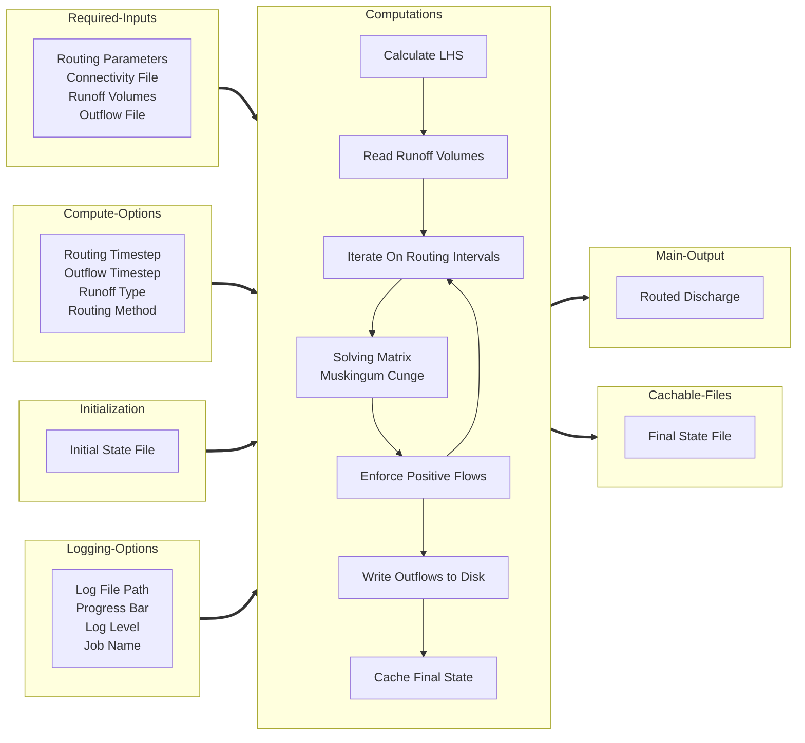

# River Route

`river-route` is a Python package for routing runoff through a river network. Routing calculations are vectorized with
numpy and scipy which keeps the array computation times on par with faster compiled languages.

## Installation

Install river-route from source using conda/mamba. It is recommended that you make a dedicated environment for this
package.

```bash
git clone https://github.com/rileyhales/river-route
cd river-route
mamba env create -f environment.yaml
mamba activate rr
python setup.py install
```

## Quick Start Guide

You will need to prepare a configuration file for the routing computations, see
the [Configuration File](#configuration-file) section for more details.

```python
import river_route as rr

(
    rr
    .MuskingumCunge('/path/to/config.yaml')
    .route()
)
```

Or you can provide all configuration parameters as keyword arguments such as with the following syntax:

```python
import river_route as rr

(
    rr
    .MuskingumCunge(**{
        'routing_params_file': '/path/to/routing_params.parquet',
        'connectivity_file': '/path/to/connectivity.parquet',
        'runoff_volumes_file': '/path/to/runoff.nc',
        'outflow_file': '/path/to/outflow.nc',
    })
    .route()
)
```

## Configuration File

The minimum required inputs in the configuration file are:

- `routing_params_file` - path to the [routing parameters file](#routing-parameters) (parquet)
- `connectivity_file` - path to the river network [connectivity file](#connectivity-file) (parquet)
- `runoff_volumes_file` - path to the prepared [runoff volumes file](#runoff-data) (netCDF)
- `outflow_file` - path where the [routed flows](#discharge-data) output file will be saved (netCDF)

You can modify how the routing computations are performed with these parameters:

- `dt_routing` - an integer time in seconds for the routing time step. Will default to 300s or 5 minutes.
  See [Time Parameters](#time-parameters).
- `dt_outflows` - an integer time in seconds for the outflow time step. Will default to the inflow time step.
  See [Time Parameters](#time-parameters).

You can provide initial conditions/state and save final conditions/state with these parameters:

- `initial_state_file` - path to the initial state file (parquet). It will not be loaded if a path is not provided.
- `final_state_file` - path where the final flows file will be saved (parquet). It will not be saved if a path is not provided.

You can provide logging options with these parameters:

- `log` - a boolean to enable or disable logging. Defaults to False.
- `log_stream` - the destination for logged messages. Either 'stdout', 'stderr' or a file path,
- `log_level` - the level of logging messages to be printed e.g. DEBUG, INFO. Defaults to INFO.
- `job_name` - a name for this job printed in logs and debug statements.
- `progress_bar` - display a computations progress bar in logs: True or False. Defaults to True.

## Computations Diagram

A diagram of the possible configuration file parameters and their role in the routing computations is shown below.



| Parameter Name            | Required | Type      | Group               | Description                                                           |                                                                                
|---------------------------|----------|-----------|---------------------|-----------------------------------------------------------------------|
| routing_params_file       | True     | File Path | Required Input      | Path to the routing parameters parquet file.                          |                                                
| connectivity_file         | True     | File Path | Required Input      | Path to the network connectivity parquet file.                        |                                              
| runoff_volumes_file       | True     | File Path | Required Input      | Path to the netCDF with runoff values to be routed.                   |                                   
| outflow_file              | True     | File Path | Required Input      | Path where the outflows netCDF file should be saved.                  |                                       
| dt_routing                | True     | Integer   | Compute Options     | Time interval in seconds between routing computations.                |                              
| dt_outflows               | False    | Integer   | Compute Options     | Time interval in seconds between writing flows to disc.               |
| routing                   | False    | String    | Compute Options     | The routing method to use: "linear" or "nonlinear".                   |
| runoff_type               | False    | String    | Compute Options     | Specify if runoff files are "sequential" time steps or an "ensemble"  |
| initial_state_file        | False    | File Path | Initialization Data | Path to the initial state file.                                       |                                                     
| final_state_file          | False    | File Path | Initialization Data | Path where the final state file should be saved.                      |                                    
| log                       | False    | Boolean   | Logging Options     | Whether to enable logging.                                            |                                       
| progress_bar              | False    | Boolean   | Logging Options     | Whether to display a progress bar when routing                        |
| log_level                 | False    | String    | Logging Options     | The logging level to print: DEBUG, INFO, CRITICAL, WARNING            |
| log_stream                | False    | String    | Logging Options     | The destination for log messages: 'stdout', 'stderr', or a file path. |
| job_name                  | False    | String    | Logging Options     | A name for this job printed in logs and debug statements.             |                           
| var_runoff_volume         | False    | String    | File Management     | Name of the variable in files containing runoff volumes               |
| var_river_id              | False    | String    | File Management     | Name of the variable in all files that contains the river IDs.        |
| var_outflow               | False    | String    | File Management     | Name of the variable in the outflows file that contains the outflows. |
| solver_atol               | False    | Float     | Solver Options      | Absolute tolerance for the solver.                                    |
## Input File Schemas

### Routing Parameters

The routing parameters file is a parquet file with 3 columns and 1 row per river in the watershed. The index is ignored.
If you use nonlinear routing, you can provide more columns with k and x values to use at different thresholds of Q.
Nonlinear routing columns should be named k_1, x_1, q_1, followed by k_2, x_2, q_2, for as many thresholds as you chose.
You may provide as many columns as you wish as long as you also provide a thresholds file.
The rows (rivers) **must be sorted in topological order** from upstream to downstream.

| Column   | Data Type | Description                                                                    |
|----------|-----------|--------------------------------------------------------------------------------|
| river_id | integer   | Unique ID of a river segment                                                   |
| k        | float     | the k parameter of the MuskingumCunge Cunge routing equation length / velocity |
| x        | float     | the x parameter of the MuskingumCunge Cunge routing equation. x : [0, 0.5]     |
| k_1      | float     | Optional, the k parameter of the MuskingumCunge Cunge routing equation at Q_1  |
| x_1      | float     | Optional, the x parameter of the MuskingumCunge Cunge routing equation at Q_1  |
| q_1      | float     | Optional, the minimum value of Q at which to start using use k_1 and x_1       |

### Connectivity File

The connectivity files is a csv with 2 columns and 1 row per river in the watershed. The index is ignored. This file
controls the topology of the rivers in the watershed. Each river segment must have at least 1 downstream segment. If the
river is an outlet then it should have a downstream ID of -1.

To specify the connectivity of braided rivers, a single river ID may have multiple rows with difference IDs given as the
downstream segment. In this case, use the 3rd column to specify the percentage (decimal in the range (0, 1)) of
discharge from the river segment that flows to the downstream segment given on that row. All rivers that are not braided
should have a weight of 1.0. The weights column of rivers that are braided should sum to exactly 1.0 or else water will
be deleted or magically inserted into the rivers.

| Column              | Data Type | Description                                                                                         |
|---------------------|-----------|-----------------------------------------------------------------------------------------------------|
| river_id            | integer   | Unique ID of a river segment                                                                        |
| downstream_river_id | integer   | Unique ID of the downstream river segment                                                           |
| weight              | float     | Optional, the percentage of discharge from this river that should be routed to the downstream river |

### Runoff and Catchment Volumes Data

Runoff volumes are given in a netCDF file. The file should have 2 dimensions: time and river_id.
The times can be given in any unit with a recognizable units string e.g. 'hours since 2000-01-01 00:00:00'.
The river_id dimension should have exactly the same IDs *AND* be sorted in the same order given in the river_id column
of the routing parameters file. Runoff values should be in a variable named "m3", in an array of shape (time, river_id),
and dtype float.

## Output File Schemas

### Discharge Data

Discharge data are given in a netCDF file. The file has 2 dimensions: time and river_id.
The times given will exactly match the times given in the runoff data unless a different time interval was specified.
The river_id dimension will exactly match the IDs given in the river_id column of the routing parameters file. Discharge
values will be in a variable named "Q", in an array of shape (time, river_id), and dtype float.

## Time Parameters

### Parameter Descriptions

Only 1 time option is a required input in the configuration file:

- `dt_routing` - the time interval, in seconds, between routing calculation steps. It must be constant across all rivers
  and for the full simulation.

3 other time parameters are optional. They may be provided in the configuration file, or they will be derived from the
runoff data.

- `dt_runoff` - the time interval, in seconds, between runoff values. It must be constant between all time steps of
  runoff.
- `dt_outflow` - the time interval, in seconds, between outflow values which get written to disc. It must be constant
  between all time steps of outflow.
- `dt_total` - the total time, in seconds, of the runoff data. It is equal to the number of time steps multiplied
  by `dt_runoff`.

### Parameter Relationships

```
dt_total >= dt_outflow >= dt_runoff >= dt_routing
```

- The total time of the runoff data must be greater than or equal to the time interval between outflow values.
- The time interval between outflow values must be greater than or equal to the time interval between runoff values.
- The time interval between runoff values must be greater than or equal to the time interval between routing
  calculations.

```
dt_total % dt_outflow == 0
dt_outflow % dt_runoff == 0
dt_runoff % dt_routing == 0
```

- Each time interval must be evenly divisible by the next smallest time interval so that the loops of calculations can
  be automatically constructed.

```
dt_total === dt_runoff * number_of_time_steps
```

- The length of the routing computations must be equal to the length of the runoff data.

### Limitations

1. You must route each interval of runoff data at least 1 time before the next interval of runoff data. You should
   resample the runoff data to larger or smaller time intervals using your own methods before routing.
2. You cannot run the routing calculations for longer than runoff data are available. If the runoff data cover 10 days,
   the routing computations will only last 10 days. Routing longer can be accomplished by padding the runoff data with
   zero values for more time steps.

## Tips for efficient computations

Results will vary based on your system specifications, the size of the river network, and the length of the simulation.
These tips may help you achieve faster results.

1. **Use fewer inflow files**: File IO operations can be relatively slow and are a probable bottleneck on HPC systems
   when I/O operations depend on networked drives. You may achieve faster results by doing a single computation
   covering 2 weeks instead of 14 computations covering 1 day each. The trade-off is that larger arrays consume more
   memory which could eventually become too large if your river network is very large.
2. **Adjust the time step**: Using a longer time step will reduce the number of computations and therefore take less
   time to compute. It also requires storing fewer intermediate results in memory yielding a modest reduction in memory
   usage. A longer time step can increase performance if it does not induce numerical instability in the outflows.
