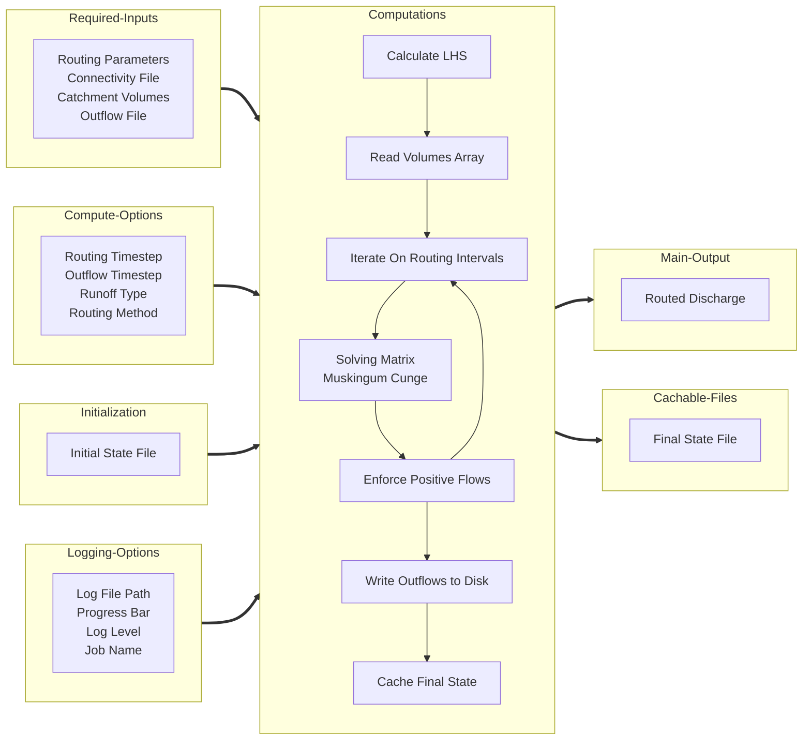

# River-Route

The `river-route` Python package is a tool for routing catchment runoff volumes on vector stream networks using the
Matrix Muskingum Cunge Method. It implements a matrix form of the Muskingum Cunge routing method first published by 
[Cedric David in 2011](https://doi.org/10.1175/2011JHM1345.1) and corrected by Riley Hales in 2024.

## Installation

!!! note
    Refer to the [Basic Tutorial](tutorials/basic-tutorial.md) and [Advanced Tutorial](tutorials/advanced-tutorial.md) 
    for more complete instructions.

`river-route` is currently only available from source. To get the highest performance, you may want to install in a 
dedicated conda environment with the latest version of python and the dependencies.

```commandline
git clone https://github.com/rileyhales/river-route
cd river-route
conda env create -f environment.yaml -n rr
conda activate rr
python setup.py install
```

## Computation Process



## Usage Example

You can pass the configuration options to the `rr.MuskingumCunge` class init by specifying a path to a config file, use
keyword arguments, or use both a config file path and keyword arguments to supplement or override values from the config
file.

```python
import river_route as rr

# Option 1 - Give all arguments via a configuration file
(
    rr
    .MuskingumCunge('/path/to/config.yaml')
    .route()
)

# Option 2 - Give all arguments via keyword arguments
(
    rr
    .MuskingumCunge(**{
        'routing_params_file': '/path/to/routing_params.parquet',
        'connectivity_file': '/path/to/connectivity.parquet',
        'catchment_volumes_file': '/path/to/volumes.nc',
        'outflow_file': '/path/to/outflow.nc',
    })
    .route()
)

# Option 3 - Use both a configuration file and keyword arguments
(
    rr
    .MuskingumCunge(
        '/path/to/config.yaml',
        **{
            'routing_params_file': '/path/to/routing_params.parquet',
            'connectivity_file': '/path/to/connectivity.parquet',
            'catchment_volumes_file': '/path/to/volumes.nc',
            'outflow_file': '/path/to/outflow.nc',
        }
    )
    .route()
)
```