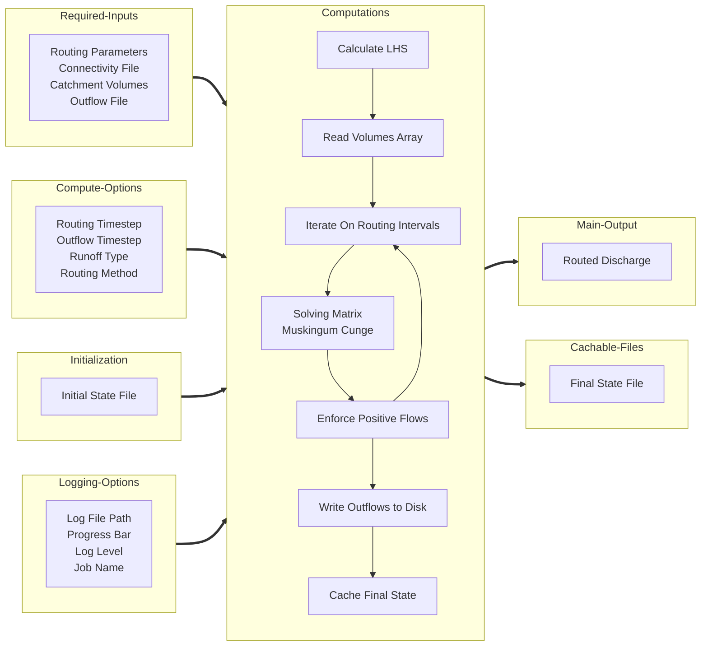

# River-Route

The `river-route` Python package is a tool for routing catchment runoff volumes on vector stream networks using the Matrix Muskingum Cunge Method.
It implements Matrix Muskingum Cunge routing. Inspired by the first linear routing implementation published by 
[Cedric David in 2011](https://doi.org/10.1175/2011JHM1345.1) which was corrected and improved by Riley Hales in 2023.

## Quick Start

!!! note
    `river-route` requires prepared watershed and runoff datasets. Refer to the [Tutorial](tutorial/basic-tutorial.md)
    and [Advanced Tips](tutorial/advanced-tutorial.md).

```commandline
pip install river-route
```

```python
import river_route as rr

(
    rr
    .MuskingumCunge('/path/to/config.yaml')
    .route()
)
```

## Computation Process



## Usage Example

You can pass the configuration options to the `rr.MuskingumCunge` class init by specifying a path to a config file, use
keyword arguments, or use both a config file path and keyword arguments to supplement or override values from the config
file.

```python
import river_route as rr

# Option 1 - Give all arguments via a configuration file
(
    rr
    .MuskingumCunge('/path/to/config.yaml')
    .route()
)

# Option 2 - Give all arguments via keyword arguments
(
    rr
    .MuskingumCunge(**{
        'routing_params_file': '/path/to/routing_params.parquet',
        'connectivity_file': '/path/to/connectivity.parquet',
        'catchment_volumes_file': '/path/to/volumes.nc',
        'outflow_file': '/path/to/outflow.nc',
    })
    .route()
)

# Option 3 - Use both a configuration file and keyword arguments
(
    rr
    .MuskingumCunge(
        '/path/to/config.yaml',
        **{
            'routing_params_file': '/path/to/routing_params.parquet',
            'connectivity_file': '/path/to/connectivity.parquet',
            'catchment_volumes_file': '/path/to/volumes.nc',
            'outflow_file': '/path/to/outflow.nc',
        }
    )
    .route()
)
```