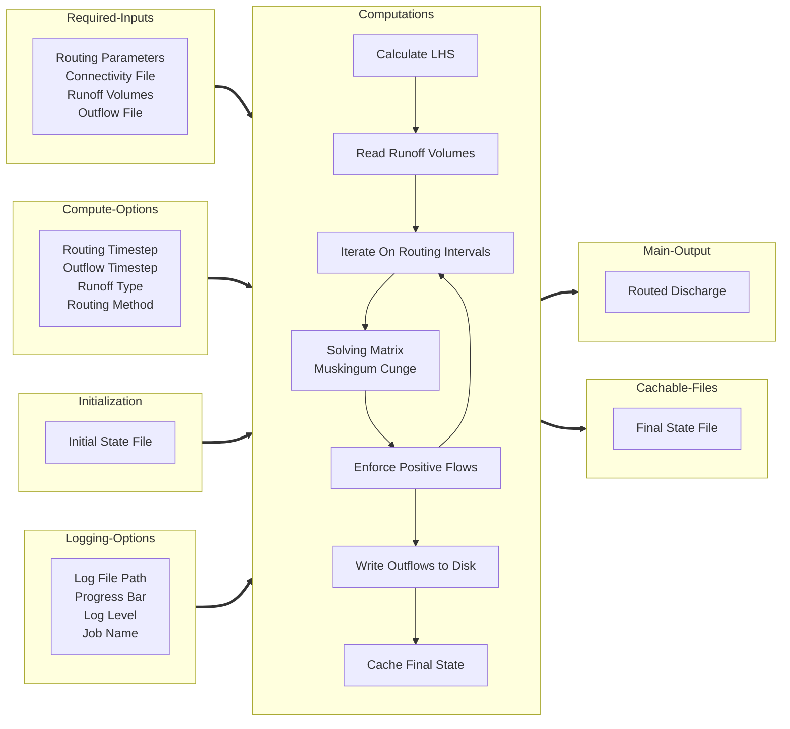

# River Route

The River Route Python package is a tool for routing catchment runoff volumes on vector stream networks using the 
Matrix Muskingum Cunge Method.

## Installation

It is recommended to install river-route in its own environment so you can ensure the latest versions of all the 
dependencies and to protect the environment that produces your model results from accidents.

River-Route is currently only available from source.

```commandline
git clone https://github.com/rileyhales/river-route
cd river-route
conda env create -f environment.yaml -n rr
conda activate rr
python setup.py install
```

## Quick Start Guide

In order to use river-route, you will need to

1. Install river-route
2. Prepare your input data
3. Create a [Configuration File](configs/config-options.md#example-yaml-file)
4. Run a simulation


## Computation Process


## Usage Example

You can pass the configuration options to the `rr.MuskingumCunge` class init by specifying a path to a config file, use
keyword arguments, or use both a config file path and keyword arguments to supplement or override values from the config
file.

```python
import river_route as rr

# Option 1 - Give all arguments via a configuration file
(
    rr
    .MuskingumCunge('/path/to/config.yaml')
    .route()
)

# Option 2 - Give all arguments via keyword arguments
(
    rr
    .MuskingumCunge(**{
        'routing_params_file': '/path/to/routing_params.parquet',
        'connectivity_file': '/path/to/connectivity.parquet',
        'runoff_volumes_file': '/path/to/runoff.nc',
        'outflow_file': '/path/to/outflow.nc',
    })
    .route()
)

# Option 3 - Use both a congiuration file and keyword arguments
(
    rr
    .MuskingumCunge(
        '/path/to/config.yaml',
        **{
            'routing_params_file': '/path/to/routing_params.parquet',
            'connectivity_file': '/path/to/connectivity.parquet',
            'runoff_volumes_file': '/path/to/runoff.nc',
            'outflow_file': '/path/to/outflow.nc',
        }
    )
    .route()
)
```