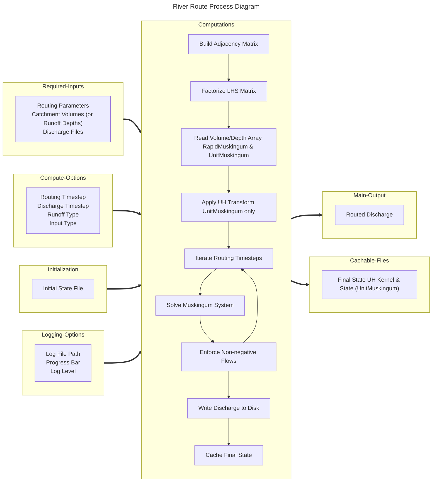
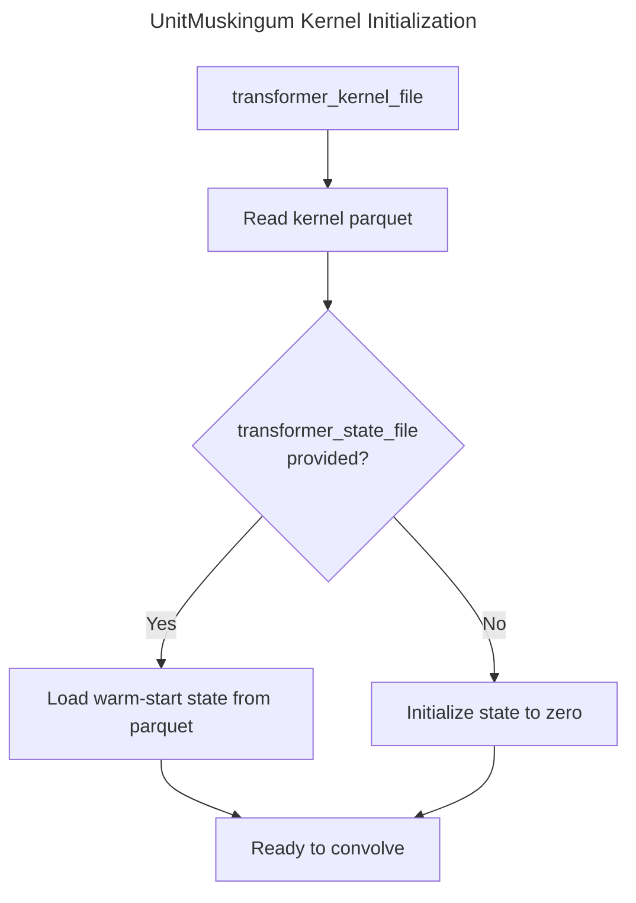

# River-Route

The `river-route` Python package routes runoff volumes and discharge through river networks using vectorized,
sparse-matrix solvers. It is designed for large networks of rivers and catchments.

## Routers

You have these options for how to do hydrological routing

### Channel routing only

| Router   | Description                                               |
|----------|-----------------------------------------------------------|
| `Router` | Matrix muskingum channel routing with no lateral inflows. |

### Channel routing with runoff lateral inflows

| Router           | Description                                                                                                                    |
|------------------|--------------------------------------------------------------------------------------------------------------------------------|
| `RapidMuskingum` | Runoff is treated as a point source at the catchment inlet which all enters the inlet during the interval the runoff occurs.   | 
| `UnitMuskingum`  | Runoff transformed via convolution with user provided unit hydrographs at each catchment then routed in the downstream segment |

### (Future) Channel routing with runoff lateral inflows and reservoir routing

## Start Here

1. [Preparing Watersheds](tutorial/prepare-watersheds.md)
2. [Muskingum Channel Routing](tutorial/channel-routing.md)
3. [Channel Routing with Runoff Transformation](tutorial/unit-hydrograph-routing.md)
4. [Customizing Outputs](tutorial/customizing-outputs.md)
5. [Routing Ensembles](tutorial/routing-ensembles.md)
6. [Generating UH Kernels](tutorial/create-uh-kernels.md)

```commandline
pip install river-route
```

```python
import river_route as rr

# Most common: route runoff volumes through the network
(
    rr
    .RapidMuskingum('/path/to/config.yaml')
    .route()
)
```

## Computation Process


```mermaid
---
title: River Route Process Diagram
---
graph LR
    subgraph "Required-Inputs"
        Inputs["Routing Parameters\nCatchment Volumes (or Runoff Depths)\nDischarge Files"]
    end

    subgraph "Compute-Options"
        co1["Routing Timestep\nDischarge Timestep\nRunoff Type\nInput Type"]
    end

    subgraph "Initialization"
        i1["Initial State File"]
    end

    subgraph "Logging-Options"
        management["Log File Path\nProgress Bar\nLog Level"]
    end

    subgraph "Computations"
        direction TB
        a[Build Adjacency Matrix] --> b
        b[Factorize LHS Matrix] --> c
        c[Read Volume/Depth Array RapidMuskingum & UnitMuskingum] --> d
        d[Apply UH Transform UnitMuskingum only] --> e
        e[Iterate Routing Timesteps] --> f
        f[Solve Muskingum System] --> g
        g[Enforce Non-negative Flows] --> h & e
        h[Write Discharge to Disk] --> i
        i[Cache Final State]
    end

    subgraph "Main-Output"
        Result[Routed Discharge]
    end

    subgraph "Cachable-Files"
        CachedFiles["Final State UH Kernel & State (UnitMuskingum)"]
    end

    Required-Inputs & Compute-Options & Initialization & Logging-Options ==> Computations
    Computations ==> Main-Output & Cachable-Files
```

## UnitMuskingum Convolution

`UnitMuskingum` convolves each runoff timestep with a precomputed unit hydrograph kernel before
passing the result to channel routing. The kernel is provided as a parquet file.


```mermaid
---
title: UnitMuskingum Kernel Initialization
---
graph TD
    A[transformer_kernel_file] --> B[Read kernel parquet]
    B --> C{transformer_state_file\nprovided?}
    C -->|Yes| D[Load warm-start state from parquet]
    C -->|No| E[Initialize state to zero]
    D & E --> F[Ready to convolve]
```

## Usage Examples

Configuration options are passed as a config file path, keyword arguments, or both. Keyword arguments
override any value in the config file.

```python
import river_route as rr

# Option 1 - Config file only
(
    rr
    .RapidMuskingum('/path/to/config.yaml')
    .route()
)

# Option 2 - Keyword arguments only
(
    rr
    .RapidMuskingum(**{
        'routing_params_file': '/path/to/routing_params.parquet',
        'lateral_volume_files': '/path/to/volumes.nc',
        'discharge_files': '/path/to/discharge.nc',
    })
    .route()
)

# Option 3 - Config file with keyword argument overrides
(
    rr
    .RapidMuskingum(
        '/path/to/config.yaml',
        **{
            'lateral_volume_files': '/path/to/volumes.nc',
            'discharge_files': '/path/to/discharge.nc',
        }
    )
    .route()
)

# Unit-Muskingum (with SCS triangular unit hydrograph)
(
    rr
    .UnitMuskingum('/path/to/config.yaml')
    .route()
)
```
