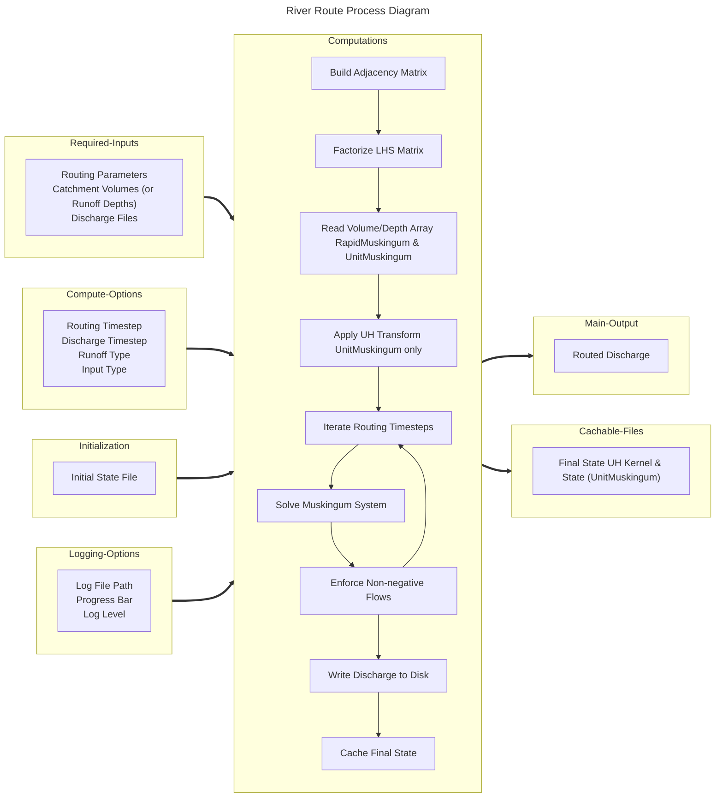
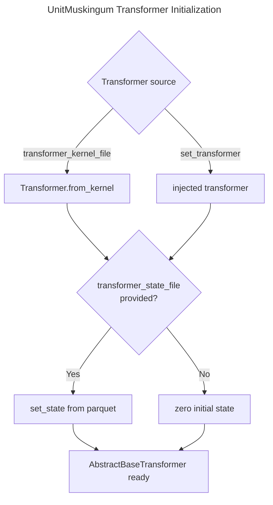

# River-Route

The `river-route` Python package routes runoff volumes and discharge through river networks using vectorized,
sparse-matrix solvers. It is designed for large networks of rivers and catchments.

## Routers

Three routers are available:

| Router           | Description                                                                                                   |
|------------------|---------------------------------------------------------------------------------------------------------------|
| `Muskingum`      | Channel routing with no lateral inflows.                                                                      |
| `RapidMuskingum` | Overland runoff placed at catchment inlets uniformly over the runoff timestep. Muskingum channel routing.     |
| `UnitMuskingum`  | Overland runoff transformed by a pluggable unit hydrograph before channel routing. Muskingum channel routing. |

## Start Here

1. [Basic Walkthrough](tutorial/basic-tutorial.md)
2. [Advanced Concepts](tutorial/advanced-tutorial.md)
3. [Routing Ensembles](tutorial/routing-ensembles.md)
4. [Unit Hydrograph Routing](tutorial/unit-hydrograph-routing.md)

```commandline
pip install river-route
```

```python
import river_route as rr

# Most common: route runoff volumes through the network
(
    rr
    .Muskingum('/path/to/config.yaml')
    .route()
)
```

## Computation Process


```mermaid
---
title: River Route Process Diagram
---
graph LR
    subgraph "Required-Inputs"
        Inputs["Routing Parameters\nCatchment Volumes (or Runoff Depths)\nDischarge Files"]
    end

    subgraph "Compute-Options"
        co1["Routing Timestep\nDischarge Timestep\nRunoff Type\nInput Type"]
    end

    subgraph "Initialization"
        i1["Initial State File"]
    end

    subgraph "Logging-Options"
        management["Log File Path\nProgress Bar\nLog Level"]
    end

    subgraph "Computations"
    direction TB
    a[Build Adjacency Matrix] --> b
    b[Factorize LHS Matrix] --> c
    c[Read Volume/Depth Array RapidMuskingum & UnitMuskingum] --> d
    d[Apply UH Transform UnitMuskingum only] --> e
    e[Iterate Routing Timesteps] --> f
    f[Solve Muskingum System] --> g
    g[Enforce Non-negative Flows] --> h & e
    h[Write Discharge to Disk] --> i
    i[Cache Final State]
    end

    subgraph "Main-Output"
    Result[Routed Discharge]
    end

    subgraph "Cachable-Files"
    CachedFiles["Final State UH Kernel & State (UnitMuskingum)"]
    end

    Required-Inputs & Compute-Options & Initialization & Logging-Options ==> Computations
    Computations ==> Main-Output & Cachable-Files
```

## UnitMuskingum Transformer

`UnitMuskingum` delegates runoff transformation to a pluggable `AbstractBaseTransformer` subclass.
Two initialization paths are available:


```mermaid
---
title: UnitMuskingum Transformer Initialization
---
graph TD
    A{Transformer source} -->|transformer_kernel_file| B[Transformer.from_kernel]
    A -->|set_transformer| E[injected transformer]
    B --> F{transformer_state_file\nprovided?}
    E --> F
    F -->|Yes| G[set_state from parquet]
    F -->|No| H[zero initial state]
    G & H --> I[AbstractBaseTransformer ready]
```

## Usage Examples

Configuration options are passed as a config file path, keyword arguments, or both. Keyword arguments
override any value in the config file.

```python
import river_route as rr

# Option 1 - Config file only
(
    rr
    .RapidMuskingum('/path/to/config.yaml')
    .route()
)

# Option 2 - Keyword arguments only
(
    rr
    .RapidMuskingum(**{
        'routing_params_file': '/path/to/routing_params.parquet',
        'lateral_volume_files': '/path/to/volumes.nc',
        'discharge_files': '/path/to/discharge.nc',
    })
    .route()
)

# Option 3 - Config file with keyword argument overrides
(
    rr
    .RapidMuskingum(
        '/path/to/config.yaml',
        **{
            'lateral_volume_files': '/path/to/volumes.nc',
            'discharge_files': '/path/to/discharge.nc',
        }
    )
    .route()
)

# Unit-Muskingum (with SCS triangular unit hydrograph)
(
    rr
    .UnitMuskingum('/path/to/config.yaml')
    .route()
)
```
