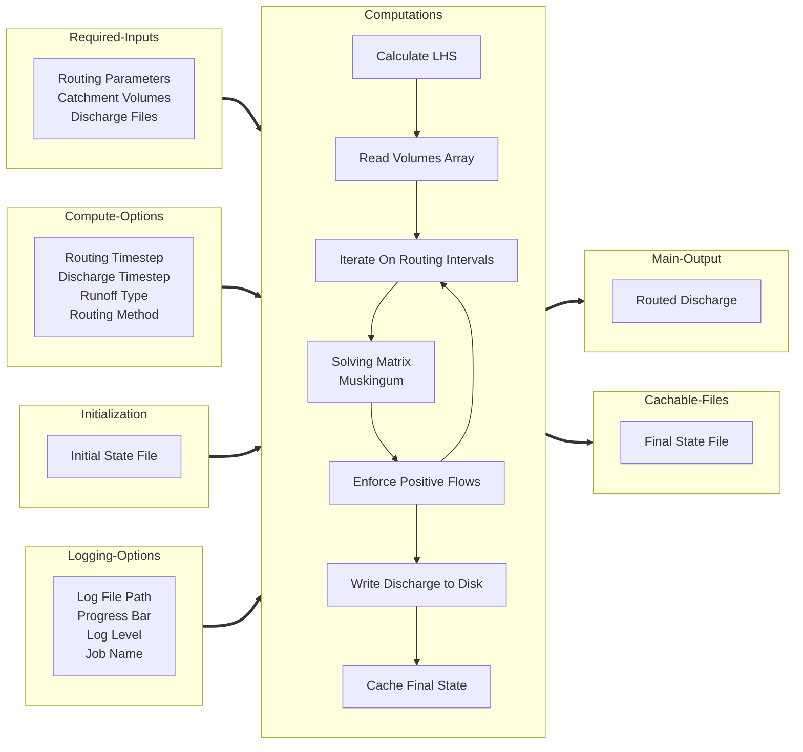

# River-Route

The `river-route` Python package is a tool for routing catchment runoff volumes on vector stream networks.
It implements Matrix Muskingum routing and Clark-Muskingum routing. Inspired by the first implementation published by
[Cedric David in 2011](https://doi.org/10.1175/2011JHM1345.1) which was corrected and improved by Riley Hales in 2023.

## Start Here

1. [Basic Walkthrough](tutorial/basic-tutorial.md)
2. [Clark-Muskingum Tutorial](tutorial/clark-muskingum.md)
3. [Advanced Concepts](tutorial/advanced-tutorial.md)

```commandline
pip install river-route
```

```python
import river_route as rr

(
    rr
    .Muskingum('/path/to/config.yaml')
    .route()
)

(
    rr
    .ClarkMuskingum('/path/to/config_clark.yaml')
    .route()
)
```

## Computation Process


```mermaid
---
Title: River Route Process Diagram
---
graph LR
    subgraph "Required-Inputs"
        Inputs["Routing Parameters\nCatchment Volumes\nDischarge Files"]
    end

    subgraph "Compute-Options"
        co1["Routing Timestep\nDischarge Timestep\nRunoff Type\nRouting Method"]
    end

    subgraph "Initialization"
        i1["Initial State File"]
    end

    subgraph "Logging-Options"
        management["Log File Path\nProgress Bar\nLog Level\nJob Name"]
    end

    subgraph "Computations"
        direction TB
        a[Calculate LHS] --> b
        b[Read Volumes Array] --> c
        c[Iterate On Routing Intervals] --> d
        d[Solving Matrix\nMuskingum] --> e
        e[Enforce Positive Flows] --> f & c
        f[Write Discharge to Disk] --> g
        g[Cache Final State]
    end

    subgraph "Main-Output"
        Result[Routed Discharge]
    end

    subgraph "Cachable-Files"
        CachedFiles["Final State File"]
    end

    Required-Inputs & Compute-Options & Initialization & Logging-Options ==> Computations
    Computations ==> Main-Output & Cachable-Files
```

## Usage Example

You pass configuration options to either `rr.Muskingum` or `rr.ClarkMuskingum` by specifying the config file path or using keyword arguments.
If for any reason it is easier to determine the available options at runtime, you can combine the method. Note that keyword arguments 
will override any value given in the config file.

```python
import river_route as rr

# Option 1 - Give all arguments via a configuration file
(
    rr
    .Muskingum('/path/to/config.yaml')
    .route()
)

# Option 2 - Give all arguments via keyword arguments
(
    rr
    .Muskingum(**{
        'routing_params_file': '/path/to/routing_params.parquet',
        'catchment_volumes_files': '/path/to/volumes.nc',
        'discharge_files': '/path/to/discharge.nc',
    })
    .route()
)

# Option 3 - Use both a configuration file and keyword arguments
(
    rr
    .Muskingum(
        '/path/to/config.yaml',
        **{
            'routing_params_file': '/path/to/routing_params.parquet',
            'catchment_volumes_files': '/path/to/volumes.nc',
            'discharge_files': '/path/to/discharge.nc',
        }
    )
    .route()
)
```
