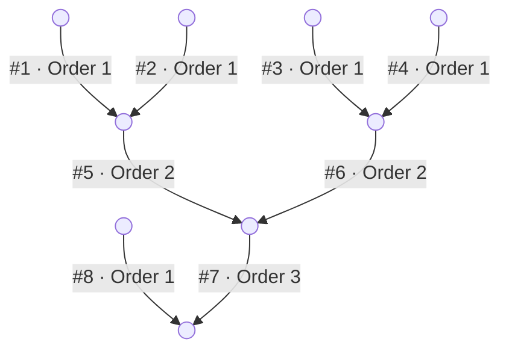

# Mathematical Derivations

Derivations of the Muskingum routing equation and alternative methods for the most efficient methods for solving the linear system.

---

## Summary

Some key insights applying linear algebra and graph theory to river networks and the Muskingum equation are:

1. River networks are directed acyclic graphs (DAGs).
2. River segments can be topologically sorted so that upstream always comes before downstream.
3. Topological ordering makes the adjacency matrix $A$ strictly lower triangular.
4. River network adjacency matrices are extremely sparse with exactly one nonzero entry per column (except for outlets).
5. The Muskingum equation LHS $\mathbf{I} - c_1 A$ is unit lower triangular. The identity contributes ones on the
   diagonal; $c_1 A$ contributes entries only below.
6. Unit lower triangular systems are best solved with forward substitution.


## Muskingum Routing

The Muskingum equation relates the outflow $Q_{t+1}$ to the inflow at the next step $I_{t+1}$, inflow at the current step $I_{t}$,
and the current discharge $Q_t$. Equivalent forms also use the notations $Q_{t}$ and $Q_{t-1}$. For a primer on the
derivation of the Muskingum equation as a relationship of storage, inflow, and outflow, try the HEC-HMS manual pages on the
[Muskingum Model](https://www.hec.usace.army.mil/confluence/hmsdocs/hmstrm/channel-flow/muskingum-model) and the
[Muskingum-Cunge Model](https://www.hec.usace.army.mil/confluence/hmsdocs/hmstrm/channel-flow/muskingum-cunge-model).

$$
Q_{t+1} = c_1\, I_{t+1} + c_2\, I_t + c_3\, Q_t
$$

Where the coefficients $c_1$, $c_2$, $c_3$ are given by:

$$
c_1 = \frac{\Delta t / k - 2x}{\Delta t / k + 2(1-x)}
\qquad
c_2 = \frac{\Delta t / k + 2x}{\Delta t / k + 2(1-x)}
\qquad
c_3 = \frac{2(1-x) - \Delta t / k}{\Delta t / k + 2(1-x)}
$$

Note that:

- Mass is conserved.
- $c_1 + c_2 + c_3 = 1$
- The $k$ parameters can be shown to be the flood wave travel time along the channel in seconds
- The $x$ parameter is a dimensionless "attenuation" factor between 0 (max attenuation) and 0.5 (no attenuation).
- Every time step depends on the step before. The solution must be found sequentially rather than parallelized across time steps.

## Matrix Formulation

### Topological sorting and network adjacency

Rivers are often described as "networks" or "systems". When being modeled, river networks have a few properties that are useful
to take advantage of for mathematically more efficient algorithms.

1. They are "directed" -- meaning water only flows in one direction from upstream to downstream.
2. They are "acyclic" -- meaning there are no loops because water cannot flow upstream.
3. They are "dendritic" -- meaning they branch out when going upstream and merge when going downstream (ignoring braided rivers and deltas, for instance).

Rivers can be topologically sorted. Rather than sorting them from high to low by an attribute or an ID, topologically sorting means
sorting them in the order they are connected in the network. That is, from "upstream to downstream". The further upstream a river is
the earlier it should appear in the sorted list. A useful tool for conceptualizing and diagramming this is the Strahler stream order.
The Strahler order assigns the number 1 to the most upstream, or headwater, segments. When two segments of the same order merge, the
downstream segment is assigned an order 1 higher. If two different order merge, the downstream segment is assigned the higher of the
two inlet orders. Streams that are a headwater area have no upstream segments.

<div style="text-align: center;">



<figcaption><em>Figure 1: A topologically sorted river network labeled with Strahler stream orders.</em></figcaption>
</div>

In the diagram above, rivers 1 through 4 and 8 are headwaters with no upstream dependencies. Rivers 5 and 6 each receive two headwater
tributaries and are indexed after their upstream sources. River 7 merges two second-order streams and river 9, the outlet, appears last.
Another way to describe rivers that are topologically sorted is that they are sorted in order of independence. Segments at the top of
the list depend on no rivers and rivers further down the list depend on a greater number of upstream segments to get their inflow.
River 5's inflow depends on what is discharged from rivers 1 and 2. A river's discharge cannot be computed until all of upstream
contributors are known.

Some river datasets will have multiple segments in a row which have the same river order. In those cases, you could sort rivers of
the same order by increasing cumulative drainage area or another attribute that increases as you go downstream. There are multiple
valid ways to sort rivers which are all topologically sorted. It is not unique. The only requirement is that upstream segments
appear before downstream segments in the sorted list.

### Adjacency matrix

An adjacency matrix $A$ encodes the connectivity of the river network into a square matrix of size $n_\text{segments} \times n_\text{segments}$.
The entry $A_{ij}$ is 1 if segment $j$ flows into segment $i$, and 0 otherwise. Because of the topological sorting, $A$ is strictly lower
triangular (all zeros on the diagonal and above). In each row, the 1 indicates that the river in that column is directly upstream. Conversely,
in each column, a 1 indicates that the river is directly downstream. Every column should have exactly 1 nonzero entry except for outlets which
have no values. Rows with no values are headwater segments. $A^T$ is also common and has an inverse interpretation of rows and columns.

<div class="matrix-grid">
<table>
  <caption><em>Table 1: Adjacency matrix for the river network in Figure 1. Entry A<sub>ij</sub> = 1 indicates segment j flows into segment i.</em></caption>
  <tr><th></th><th>R1</th><th>R2</th><th>R3</th><th>R4</th><th>R5</th><th>R6</th><th>R7</th><th>R8</th><th>R9</th></tr>
  <tr><th>R1</th><td></td><td></td><td></td><td></td><td></td><td></td><td></td><td></td><td></td></tr>
  <tr><th>R2</th><td></td><td></td><td></td><td></td><td></td><td></td><td></td><td></td><td></td></tr>
  <tr><th>R3</th><td></td><td></td><td></td><td></td><td></td><td></td><td></td><td></td><td></td></tr>
  <tr><th>R4</th><td></td><td></td><td></td><td></td><td></td><td></td><td></td><td></td><td></td></tr>
  <tr><th>R5</th><td>1</td><td>1</td><td></td><td></td><td></td><td></td><td></td><td></td><td></td></tr>
  <tr><th>R6</th><td></td><td></td><td>1</td><td>1</td><td></td><td></td><td></td><td></td><td></td></tr>
  <tr><th>R7</th><td></td><td></td><td></td><td></td><td>1</td><td>1</td><td></td><td></td><td></td></tr>
  <tr><th>R8</th><td></td><td></td><td></td><td></td><td></td><td></td><td></td><td></td><td></td></tr>
  <tr><th>R9</th><td></td><td></td><td></td><td></td><td></td><td></td><td>1</td><td>1</td><td></td></tr>
</table>
</div>

When you matrix-multiply $A$ (shape $(n_\text{segments}, n_\text{segments})$) by a column vector of discharges $Q_t$ (shape $(n_\text{segments}, 1)$),
the result is a column vector of inflows $I_t$ with shape $(n_\text{segments}, 1)$. The zero entries of $A$ drop the rows of $Q_t$ that are not directly
upstream. The upstream segments are summed for the total inflow.

$$
I_t = A\, Q_t
$$

Because the rivers are listed in a topological order, $A$ is strictly lower triangular and the diagonal is zero. $A$ is extremely sparse so computationally
it's more efficient to store it in a sparse format and do math only on the non-zero elements.

## Derivation of Matrix Muskingum

Using the Adjacency matrix and the definition that $I_t$ is the sum of upstream discharges, we can replace all $I$ with $A\, Q$.

Muskingum equation:

$$
Q_{t+1} = c_1\, I_{t+1} + c_2\, I_t + c_3\, Q_t
$$

Substitute all $I$ terms with $A\, Q$:

$$
Q_{t+1} = c_1\, \bigl(A\, Q_{t+1}\bigr) + c_2\, \bigl(A\, Q_t\bigr) + c_3\, Q_t
$$

Move all $Q_{t+1}$ terms to the left-hand side:

$$
Q_{t+1} - c_1\, \bigl(A\, Q_{t+1}\bigr) = c_2\, \bigl(A\, Q_t\bigr) + c_3\, Q_t
$$

Factor out $Q_{t+1}$ by right side matrix multiplication:

$$
\bigl(\mathbf{I} - c_1\, A\bigr)\; Q_{t+1} = c_2\, \bigl(A\, Q_t\bigr) + c_3\, Q_t
$$

Notes:

- The LHS is the same for every time step (only depends on $A$ and $c_1$).
- The RHS changes every sequential time step because it depends on the previous discharge.
- $c_2$ and $c_3$ can be expressed as 1D vectors of length $n_\text{segments}$ for vector multiplication.
- $c_1$ is an $NxN$ diagonal matrix so it can be subtracted from $I$ after multiplication with A.

### Muskingum Cunge Routing

The Muskingum Cunge equation adds the term $c_4$ to weight adding a lateral inflow term $Q_l$ to
each segment. In the RAPID assumption, lateral flow is the runoff volume divided by the runoff
time step, meaning all runoff enters the channel and exits the basin in the interval it is generated.
No overland flow time or attenuation occurs.

$$
Q_{t+1} = c_1\, I_{t+1} + c_2\, I_t + c_3\, Q_t + c_4\, Q_{l,t}
$$

where $c_4 = c_1 + c_2$. In matrix form:

$$
\bigl(\mathbf{I} - c_1\, A\bigr)\; Q_{t+1} = c_2\, \bigl(A\, Q_t\bigr) + c_3\, Q_t + c_4\, Q_{l,t}
$$

## UnitMuskingum — Unit Hydrograph Lateral Inflow

### Derivation

UnitMuskingum combines Muskingum channel routing with unit hydrograph lateral inflow. The unit hydrograph shape is developed
in a way that accounts for all the attenuation and travel time during the overland flow process. Thus, we cannot directly
add it to the equation using the $c_4$ term as in the Muskingum Cunge equation because additional attenuation and travel time
will be applied. Instead, a unique method for solving uses the superposition principle where the unit hydrograph convolution
discharge is superimposed on the routed discharge so the signal of the runoff transformation is preserved. In this form,
$Q_l$ represents the discharge generated from a unit hydrograph convolution during the current timestep, $t$.

Establish the relationship between total, routed, and lateral flow.

$$
Q_{\text{total},t+1} = Q_{\text{channel},t+1} + Q_{\text{lateral},t+1}
$$

$$
I_{\text{total},t+1} = I_{\text{channel},t+1} + I_{\text{lateral},t+1}
$$

Annotate the Matrix Muskingum equation with a subscript "ch" or "total".

$$
Q_{\text{channel},t+1} = c_1\, I_{\text{total},t+1} + c_2\, I_{\text{total},t} + c_3\, Q_{\text{channel},t}
$$

Substitute the relationship $I_t = A\, Q_t$

$$
Q_{\text{channel},t+1} = c_1\, \bigl(A\, Q_{\text{channel},t+1} + A\, Q_{\text{lateral},t+1}\bigr) + c_2\, \bigl(A\, Q_{\text{total},t}\bigr) + c_3\, Q_{\text{channel},t}
$$

Move all $Q_{\text{channel},t+1}$ terms to the left-hand side:

$$
Q_{\text{channel},t+1} - c_1\, \bigl(A\, Q_{\text{channel},t+1}\bigr) = c_1\, \bigl(A\, Q_{\text{lateral},t+1}\bigr) + c_2\, \bigl(A\, Q_{\text{total},t}\bigr) + c_3\, Q_{\text{channel},t}
$$

Factor out $Q_{\text{channel},t+1}$ by right side matrix multiplication:

$$
\bigl(\mathbf{I} - c_1\, A\bigr)\; Q_{\text{channel},t+1} = c_1\, \bigl(A\, Q_{\text{lateral},t+1}\bigr) + c_2\, \bigl(A\, Q_{\text{total},t}\bigr) + c_3\, Q_{\text{channel},t}
$$

Calculate the superposition of the channel and lateral flow:

$$
Q_{\text{total},t+1} = Q_{\text{channel},t+1} + Q_{\text{lateral},t+1}
$$

### Reduced Inner System

The headwater segments have no upstream dependencies and their discharge is the unit hydrograph convolution output. 
They can be excluded from the matrix solve and their outflow enters the system as a known right-hand-side contribution during the superposition step.

### Kernel Structure

A unit hydrograph kernel has shape $(n_\text{steps},\; n_\text{basins})$. It is a 2D array of each basin's unit hydrograph, discretized to the routing time step, and concatenated into 1 array.

- Each column is the discretized unit hydrograph for one basin assuming a unit runoff depth ($R = 1\,\text{m}$).
- Each row value is the average flow ($\text{m}^2/\text{s}$) over the corresponding time step.
- Volume conservation requires: $\displaystyle\sum_{i} K_{i,j} \cdot \Delta t = A_j$ where $A_j$ is the basin area ($\text{m}^2$).

### Unit Hydrograph Convolution

Given a timeseries of runoff depths $r_t$ (meters per time step), the lateral inflow at time $t$
is found by convolving the runoff with the kernel:

$$
Q_{l,t} = \sum_{\tau=0}^{n_\text{steps}-1} K_\tau \cdot r_{t-\tau}
$$

river-route implements this as a fourier transform over the full timeseries using `scipy.signal.fftconvolve`.

## Forward Substitution Algorithm

Because of the careful preparation of the routing matrices, the linear system can be solved for directly with a single forward 
substitution pass without iterative methods, preconditioning, or factorization. This is a significant simplification and efficiency 
gain in terms of the complexity of the algorithm as well as how efficiently it can be implemented and compiled in code. 

For a unit lower triangular system $L\, x = b$ of size $n$:

$$
x_i = b_i - \sum_{j < i} L_{ij}\, x_j \qquad \text{for } i = 1, 2, \ldots, n
$$

Because $L_{ii} = 1$, no division is needed. Each unknown $x_i$ depends only on previously
solved values $x_1, \ldots, x_{i-1}$, so the system is solved sequentially from the first
row to the last. Specifically, `river-route` uses a compressed sparse column (CSC) format and a
column-oriented forward substitution. Instead of computing one row at a time, it processes
one column at a time: once $x_j$ is known, its contribution is subtracted from all rows below.

```
for j = 1, 2, ..., n:
    x[j] = b[j]                          # diagonal is 1, so x[j] = b[j] directly
    for each row i where L[i,j] != 0:    # only the nonzero entries below the diagonal
        b[i] -= L[i,j] * x[j]            # subtract the now-known contribution
```
*Listing 1: Column-oriented forward substitution pseudocode for a unit lower triangular system.*

This maps directly to the CSC storage where `indptr` and `indices` give fast column-wise access
to nonzero entries. In the implementation (`_numba_kernels.py`), the loop looks like:

```python
for col in range(n):
    q[col] = rhs[col]
    for j in range(csc_indptr[col], csc_indptr[col + 1]):
        rhs[csc_indices[j]] -= lhs_off_data[j] * q[col]
```
CSC forward substitution implementation from `_numba_kernels.py`

- **Time:** $O(n + m)$ where $n$ is the number of river segments and $m$ is the number of edges
  (upstream-downstream connections). For tree-structured river networks, $m = n - 1$.
- **Space:** Only the sparse matrix entries are stored. No fill-in occurs because no
  factorization is performed.

This is optimal — every edge is visited exactly once per time step.

## References

- HEC-HMS Users Manual introduction to Muskingum Model 
  (https://www.hec.usace.army.mil/confluence/hmsdocs/hmstrm/channel-flow/muskingum-model)[https://www.hec.usace.army.mil/confluence/hmsdocs/hmstrm/channel-flow/muskingum-model]
- HEC-HMS Users Manual introduction to Muskingum Cunge Model 
  (https://www.hec.usace.army.mil/confluence/hmsdocs/hmstrm/channel-flow/muskingum-cunge-model)[https://www.hec.usace.army.mil/confluence/hmsdocs/hmstrm/channel-flow/muskingum-cunge-model]
- HEC-HMS Users Manual introduction to Unit Hydrographs 
  (https://www.hec.usace.army.mil/confluence/hmsdocs/hmstrm/transform/unit-hydrograph-basic-concepts)[https://www.hec.usace.army.mil/confluence/hmsdocs/hmstrm/transform/unit-hydrograph-basic-concepts]
- David, C. H. (2011) River Network Routing on the NHDPlus Dataset *Journal of Hydrometeorology* [doi:10.1175/2011JHM1345.1](https://doi.org/10.1175/2011JHM1345.1)
- NRCS (2010). *National Engineering Handbook*, Part 630: Hydrology, Chapter 16: Hydrographs. United States Department of Agriculture. 
- Wikipedia: [Triangular matrix — Forward substitution](https://en.wikipedia.org/wiki/Triangular_matrix#Forward_substitution).
- Wikipedia: [Topological sorting](https://en.wikipedia.org/wiki/Topological_sorting).
