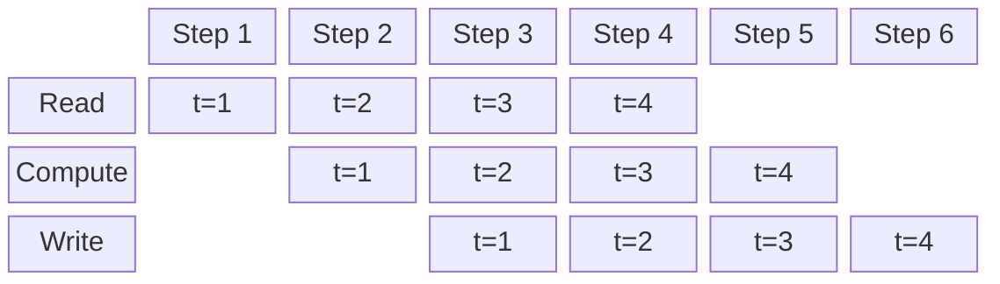

# Parallelism in River Routing

Parallelism is not free. Thread synchronization, memory duplication, process serialization, and
competing for hardware bandwidth between jobs all come with costs. The effectiveness of any
parallelism strategy is partially dependent on the compute job and the performance of the
hardware being used. A strategy that helps on one machine or dataset size may not help on another.
This page is a list of the parallelization strategies I have tried and my recommendations based on 
using these methods to operate a global hydrological model and generate a 5 trillion data point 
simulation product. I hope this is a very solid reference but won't always be true for every test.

## What cannot be parallelized?

The fundamental constraint to parallelism in river routing is that it is a time stepping process. 
You must solve for discharge in time order without skipping steps. The discharge at time `t+1` 
depends on the discharge at time `t`.

## Asynchronous pipelines for file I/O and computations

**Summary**: A single process can have up to 3 threads. 1 which reads inputs from disc, 1 which
does computations, 1 which writes results to disc. All 3 can be operating at the same time.



If you have an unfavorable combination of slow I/O, slow CPU, and large computations, this solution 
might help. Individual routing jobs get faster but by making threads for portions that depend on 
different hardware. However, using this method means you probably won't be able to use it in 
combination with another parallelization strategy because you more quickly consume memory and disc 
I/O bandwidth with one job. In my experience, this speedup is at most a few percent

**Conclusion*: This speeds up individual jobs bottlenecked by I/O but not by much given modern 
hardware capabilities.

## Multiprocessing or multithreading matrix solvers

**Summary**: Use vector solvers that use efficient and possibly parallelized methods to solve
array operations.

Forward substitution is inherently sequential: the value at row $i$ depends on all previously
solved rows $1, \ldots, i-1$. There is no way to compute row $i$ before its upstream dependencies
are known. This means the core solve cannot be split across threads or cores in a straightforward
way.

However, the forward substitutions have been made about as minimal as possible, use sparse matrix
formats, and JIT compilation. In my experience, this is preferable to multiprocessing methods even
though it uses an inherently sequential forward substitution algorithm. This approach is the best
method in my experience using it on a wide range of scales up to global computations of hourly
resolution discharge on millions of rivers and producing a 5 trillion data point simulation
product.

1. needs only mainstream scientific python dependencies simply installed on a variety of hardware
   and Python versions
2. is the most memory efficient option
3. is the computationally fastest option because it does not iterate or do any matrix conditioning
   or pivoting
4. is the direct solution so there is no error due to solver convergence tolerances.

**Conclusion**: It's less efficient to parallelize than to carefully prepare your inputs and use
better solvers.

## Complete watersheds in separate processes

**Summary**: If your computations contains several independent watersheds, you can route them
simultaneously in separate processes.

**Conclusion**: A single watershed is a self-contained unit with no dependencies on other
watersheds. You can split computations into separate watersheds, or groups of watersheds that
are processed concurrently in separate processes. This is additionally beneficial on larger
size jobs.

## Ensemble simulations in separate processes

**Summary**: Simulations of many inputs, perhaps from an ensemble of runoff projections, share 
only the initial state. Multiple members can be processed concurrently in separate processes.

In production, you will usually add logic to:

1. Set the config variables and routing parameter files
2. Find all the catchment runoff files, 1 for each member
3. Determine unique output names for each so you don't overwrite or corrupt files
4. Submit each input/output file pair to a parallel processing framework

```python title="Parallel Routing Jobs for Ensemble Members"
from multiprocessing import Pool

import river_route as rr

params_file = 'routing_parameters.parquet'
runoff_files = ['catchment_runoff_member_1.nc',
                'catchment_runoff_member_2.nc', ]
output_files = ['discharges_member_1.nc',
                'discharges_member_2.nc', ]


def route(input_file: str, output_file: str) -> None:
    rr.RapidMuskingum(
        params_file=params_file,
        qlateral_files=[input_file, ],
        discharge_files=[output_file, ],
    ).route()


if __name__ == '__main__':
    with Pool() as pool:
        pool.starmap(route, zip(runoff_files, output_files))
```

**Conclusion**: This is the best way to speed up ensemble simulations. 
