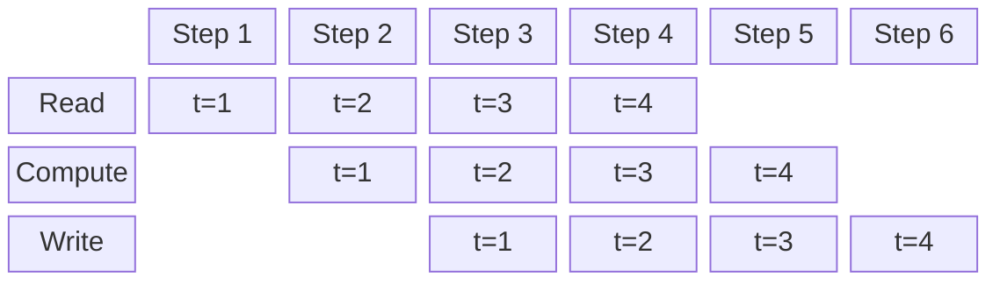

# Parallelism in River Routing

Many scientific computations jump quickly to various methods of parallelism and GPU acceleration. River routing
math is very well suited for parallelization, but it is even more advantageous to worry first about the efficiency 
of the algorithm. There are more efficiency gains to be had through careful choice of solving procedures and 
preparing the inputs in more careful ways than there is through jumping immediately to parallelization. The 
effectiveness of parallelization depends on the strategy, the size and complexity of the network, and the 
hardware being used. 

Not all parallelization strategies are worth pursing in river routing cases. This page is a list of the strategies 
tested in `river-route` and recommendations based on using these methods to operate a global hydrological model 
generating a 5 trillion data point simulation product.

The following guide is the order of significance in how effective various methods are in speeding up and increasing 
resource efficiency of routing computation. This is shared both as justification for why `river-route` is designed 
in this way and also as an educational guide for other projects. 

## What cannot be parallelized?

The two fundamental constraints in river routing. First, it is a time stepping process. At any given river, you must 
solve for discharge at the current time `t` before solving for the next time `t+1`. Second, there is an 
order dependency that river segment upstream must be solved before the current river and the downstream river.

Within a time step, the solve is a forward substitution: the value at row $i$ depends on all previously solved
rows $1, \ldots, i-1$. Water only moves downstream, so a river cannot be computed before every river upstream of it.
A large river's main stem depends on its whole basin and is always computed on one thread.

## Better ways to prepare inputs

### Topological river sorting and Depth First Search (DFS)

TBD

### Splitting watershed subgraphs

[//]: # (todo: talk about identificaiton of subgraphs and balancing size with resources)

**Summary**: If your computations contains several independent watersheds, you can route them simultaneously in separate processes.

**Conclusion**: This is more beneficial as job sizes get larger. Watersheds have no dependencies on others. Separate watersheds and
process simultaneously or combine them into a single config file if compute times are small enough.

### Formats of inputs and outputs

[//]: # (todo)

after you carefully prepare inputs and the algorithm, a large, possibly the largest, portion of remaining time is spent reading and writing data.
You should reduce the number of times the code needs to read/write data and the number of total files it needs to read/write.

## Options for parallelism

### Multithreading matrix solvers

[//]: # (todo: only if you sort the network into independent but ordered subgraphs then you can solve each with parallel threads.)

**Summary**: Use vector solvers that use efficient and possibly parallelized methods to solve array operations.

Forward substitution is inherently sequential: the value at row $i$ depends on all previously
solved rows $1, \ldots, i-1$. There is no way to compute row $i$ before its upstream dependencies
are known. This means the core solve cannot be split across threads or cores in a straightforward
way.

However, the forward substitutions have been made about as minimal as possible, use sparse matrix
formats, and JIT compilation. In my experience, this is preferable to multiprocessing methods even
though it uses an inherently sequential forward substitution algorithm. This approach is the best
method in my experience using it on a wide range of scales up to global computations of hourly
resolution discharge on millions of rivers and producing a 5 trillion data point simulation. It
has the advantages that it:

1. needs only mainstream scientific python dependencies simply installed on a variety of hardware and Python versions
2. is the most memory efficient option
3. is the computationally fastest option because it does not iterate or do any matrix conditioning or pivoting
4. is the direct solution so there is no error due to solver convergence tolerances.

**Conclusion**: Meaningful speedup is possible with multiple threads but only if you 

### Concurrent jobs vs multiple threads in one job

**Summary**: Simulations of many inputs, perhaps from an ensemble of runoff projections, share
only the initial state. Multiple members can be processed concurrently in separate processes.

In production, you will usually add logic to:

1. Set the config variables and routing parameter files
2. Find all the catchment runoff files, 1 for each member
3. Determine unique output names for each so you don't overwrite or corrupt files
4. Submit each input/output file pair to a parallel processing framework

```python title="Parallel Routing Jobs for Ensemble Members"
from multiprocessing import Pool

import river_route as rr

params_file = 'routing_parameters.parquet'
runoff_files = ['catchment_runoff_member_1.nc',
                'catchment_runoff_member_2.nc', ]
output_files = ['discharges_member_1.nc',
                'discharges_member_2.nc', ]


def route(input_file: str, output_file: str) -> None:
    configs = rr.Configs(
        forcing='vlateral',
        params_file=params_file,
        vlateral_files=[input_file, ],
        discharge_files=[output_file, ],
    )
    rr.Router(configs).route()


if __name__ == '__main__':
    with Pool() as pool:
        pool.starmap(route, zip(runoff_files, output_files))
```

**Conclusion**: This is the best way to speed up ensemble simulations. 

### Separate pipelines for reading inputs, compute, writing outputs

**Summary**: A single routing process can have up to 3 meaningful tasks: 1 reads inputs from disk, 1
does computations, 1 writes results to disk. All 3 can be operating independently at the same time.


```mermaid
block-beta
    columns 7
    space:1 s1["Step 1"] s2["Step 2"] s3["Step 3"] s4["Step 4"] s5["Step 5"] s6["Step 6"]
    r["Read"]:1 r1["t=1"] r2["t=2"] r3["t=3"] r4["t=4"] space:2
    c["Compute"]:1 space:1 c1["t=1"] c2["t=2"] c3["t=3"] c4["t=4"] space:1
    w["Write"]:1 space:2 w1["t=1"] w2["t=2"] w3["t=3"] w4["t=4"]
```

If you have an unfavorable combination of slow I/O, slow CPU, and large computations, this solution
might help. Individual routing jobs get faster but by making threads for portions that depend on
different hardware. However, using this method means you probably won't be able to use it in
combination with another parallelization strategy because you more quickly consume memory and disk
I/O bandwidth with one job. In my experience, this speedup is at most a few percent.

**Conclusion**: This speeds up individual jobs bottlenecked by I/O but not by much given modern hardware capabilities.

## Conclusions

The most important thing to work on is the efficiency of the algorithm and statically determining subgraphs.
