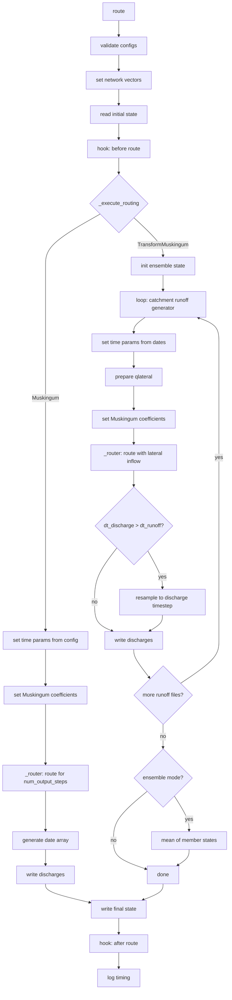

## Routing Lifecycle

All routers share the same `route()` method. The shared steps — validation, network setup, state
management, and hooks — run identically. The middle step, `_execute_routing()`, is where
Muskingum and TransformMuskingum diverge.



**Muskingum** reads time parameters directly from the config and runs a single routing pass for a
fixed number of output steps. **TransformMuskingum** (used by `RapidMuskingum`, `UnitMuskingum`, and
`ReservoirMuskingum`) loops over runoff input files, inferring time parameters from each file's
date array, and optionally resamples output to a coarser discharge timestep.

## Finding Inputs and Config Files at Runtime

Instead of manually preparing config files in advance, you may want to generate them in your code which executes the
routing. This is useful when you have a large number of routing runs to perform or if you want to automate the process.
Depending on your preference, you may want to generate many config files in advance or store them for repeatability and
future use.

The following code snippet demonstrates how to identify the essential input arguments and pass them as keyword arguments
to the `RapidMuskingum` class. You could alternatively write the inputs to a YAML or JSON file and use that config file
instead.

```python
import glob
import os

import river_route as rr

root_dir = '/path/to/root/directory'
vpu_name = 'sample-project'

configs = os.path.join(root_dir, 'configs', vpu_name)
params_file = os.path.join(configs, 'params.parquet')

runoff_files = sorted(glob.glob(f'/path/to/catchment_runoff/directory/*.nc'))

outputs = os.path.join(root_dir, 'outputs', vpu_name)
output_files = [os.path.join(outputs, f'Qout_{os.path.basename(f)}') for f in runoff_files]
os.makedirs(outputs, exist_ok=True)

m = (
    rr
    .RapidMuskingum(**{
        'params_file': params_file,
        'catchment_runoff_files': runoff_files,
        'discharge_files': output_files,
    })
    .route()
)
```

## Customizing Outputs

You can override the default function used by `river-route` when writing routed flows to disk.
By default, routed discharges are written to netCDF.

A single netCDF is not ideal for all use cases, so you can override it to store your data how you prefer. Some examples
of reasons you would want to do this include appending the outputs to an existing file, writing values to a
database, or to add metadata or attributes to the file.

You can override the `write_discharges` method directly in your code or use the `set_write_discharges` method. Your custom
function must accept exactly 4 arguments:

1. `dates`: datetime array for rows in the discharge array.
2. `discharge_array`: routed discharge array with shape `(time, river_id)`.
3. `discharge_file`: path to the output file.
4. `runoff_file`: path to the runoff input used to produce this output.

As an example, you might want to write output as Parquet instead.

```python title="Write Routed Flows to Parquet"
import pandas as pd
import xarray as xr

import river_route as rr


def custom_write_discharges(dates, discharge_array, discharge_file: str, runoff_file: str) -> None:
    with xr.open_dataset(runoff_file) as runoff_ds:
        river_ids = runoff_ds['river_id'].values
    df = pd.DataFrame(discharge_array, index=pd.to_datetime(dates), columns=river_ids)
    df.to_parquet(discharge_file)
    return


(
    rr
    .RapidMuskingum('../../examples/config.yaml')
    .set_write_discharges(custom_write_discharges)
    .route()
)
```

```python title="Write Routed Flows to SQLite"
import pandas as pd
import sqlite3
import xarray as xr

import river_route as rr


def write_discharges_to_sqlite(dates, discharge_array, discharge_file: str, runoff_file: str) -> None:
    with xr.open_dataset(runoff_file) as runoff_ds:
        river_ids = runoff_ds['river_id'].values
    df = pd.DataFrame(discharge_array, index=pd.to_datetime(dates), columns=river_ids)
    conn = sqlite3.connect(discharge_file)
    df.to_sql('routed_flows', conn, if_exists='replace')
    conn.close()
    return


(
    rr
    .RapidMuskingum('config.yaml')
    .set_write_discharges(write_discharges_to_sqlite)
    .route()
)
```

```python title="Append Routed Flows to Existing netCDF"
import os

import xarray as xr

import river_route as rr


def append_to_existing_file(dates, discharge_array, discharge_file: str, runoff_file: str) -> None:
    ensemble_number = os.path.basename(runoff_file).split('_')[1]
    ds = xr.load_dataset(discharge_file)
    ds['Q'].loc[dict(ensemble=ensemble_number)] = discharge_array
    ds.to_netcdf(discharge_file)
    return


(
    rr
    .RapidMuskingum('config.yaml')
    .set_write_discharges(append_to_existing_file)
    .route()
)
```

```python title="Save a Subset of the Routed Flows"
import pandas as pd
import xarray as xr

import river_route as rr


def save_partial_results(dates, discharge_array, discharge_file: str, runoff_file: str) -> None:
    with xr.open_dataset(runoff_file) as runoff_ds:
        river_ids = runoff_ds['river_id'].values
    df = pd.DataFrame(discharge_array, index=pd.to_datetime(dates), columns=river_ids)
    river_ids_to_save = [1, 2, 3, 4, 5, 6, 7, 8, 9, 10]
    df = df[river_ids_to_save]
    df.to_parquet(discharge_file)
    return


(
    rr
    .RapidMuskingum('config.yaml')
    .set_write_discharges(save_partial_results)
    .route()
)
```
