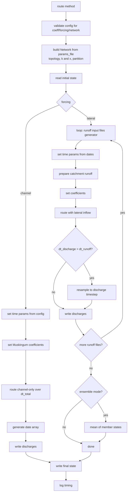

## Routing Lifecycle



`Router.route()` first validates the required config keys and inflow source for the selected
`coeff`, `forcing`, `transform`, and `network` before any routing data is read. It then builds its
[`Network`](../api/network.md) from the params file, which supplies the topology, the `k` and `x`
vectors, and the concurrent routing partition, and derives the Muskingum coefficients from them. The
numba kernel is resolved when it dispatches each routing pass (an unimplemented combination raises
`NotImplementedError` at that point). The `Network` is built once and reused, so routing repeatedly
on one `Router` re-reads and re-partitions nothing. When `forcing` is `'channel'`, time parameters are read directly from the config and a
single channel-only routing pass runs over `dt_total`. Otherwise the router loops over the runoff
input files (processed sequentially or as an ensemble), inferring time parameters from each file's
date array, routes each one, optionally resamples the output to a coarser discharge timestep, and
writes the result.

## Finding Inputs and Config Files at Runtime

Instead of manually preparing config files in advance, you may want to generate them in your code which executes the
routing. This is useful when you have a large number of routing runs to perform or if you want to automate the process.
Depending on your preference, you may want to generate many config files in advance or store them for repeatability and
future use.

The following code snippet demonstrates how to identify the essential input arguments and pass them as keyword
arguments to a `Configs`, which is then given to the `Router`. You could alternatively write the inputs to a JSON
file and use that config file instead.

```python
import glob
import os

import river_route as rr

root_dir = '/path/to/root/directory'
vpu_name = 'sample-project'

configs = os.path.join(root_dir, 'configs', vpu_name)
params_file = os.path.join(configs, 'params.parquet')

runoff_files = sorted(glob.glob(f'/path/to/catchment_runoff/directory/*.nc'))

outputs = os.path.join(root_dir, 'outputs', vpu_name)
os.makedirs(outputs, exist_ok=True)

configs = rr.Configs(
    forcing='runoff',
    runoff_type='catchment',
    params_file=params_file,
    runoff_files=runoff_files,
    discharge_dir=outputs,
)
m = rr.Router(configs).route()
```

## Customizing Outputs

You can override the default function used by `river-route` when writing routed flows to disk.
The default function, `river_route.router.writers.netcdf_writer`, writes discharge to netCDF.

Premade writers are in `river_route.router.writers`. `zarr_writer` writes each output as a zarr store with
dimensions `(river_id, time)`, built to write as fast as possible. It writes up to the `threads` given to
`Router.route` chunks at once, rounding each chunk to `writers.ZARR_KEEPBITS` mantissa bits and compressing it with
`writers.ZARR_COMPRESSOR`. `parquet_writer` writes one row per river and one column per time step, with the
pyarrow write options in `writers.PARQUET_WRITE_OPTIONS`.

```python title="Write Routed Flows to Zarr"
import river_route as rr

(
    rr
    .Router(rr.Configs.from_json('config.json'), forcing='runoff')
    .set_discharge_writer(rr.router.writers.zarr_writer)
    .route()
)
```

A single netCDF is not ideal for all use cases, so you can override it to store your data how you prefer. Some examples
of reasons you would want to do this include appending the outputs to an existing file, writing values to a
database, or to add metadata or attributes to the file.

Use the `set_discharge_writer` method to supply a custom writer function; it returns the `Router`
so you can chain it onto the constructor. The writer is called once per routed input file with 5 arguments:

1. `router`: the `Router` doing the routing, which provides `river_ids` and the `cfg` options.
2. `dates`: datetime array for the columns of the discharge array.
3. `discharge_array`: routed discharge array, C-order with shape `(river_id, time)`. The kernels route one river's
   whole series at a time and write it into that river's row, so this is the layout every writer is handed. Use
   `river_route.router.writers.to_time_major` if your format needs each time step's rivers contiguous instead.
4. `discharge_file`: path to the output file.
5. `runoff_file`: path to the runoff input used to produce this output.

As an example, you might want to write output as Parquet instead. The snippets below focus on the
writer override; for `.route()` to actually run, the config must select `forcing: runoff` and supply a
water source (`runoff_files` and `runoff_type`, plus `grid_weights_file` for the grid runoff types).

```python title="Write Routed Flows to Parquet"
import pandas as pd

import river_route as rr


def custom_write_discharges(router, dates, discharge_array, discharge_file: str, runoff_file: str) -> None:
    # discharge_array is (river_id, time), so transpose it for a frame indexed by time
    df = pd.DataFrame(discharge_array.T, index=pd.to_datetime(dates), columns=router.network.river_ids)
    df.to_parquet(discharge_file)
    return


(
    rr
    .Router(rr.Configs.from_json('../../examples/config.json'), forcing='runoff')
    .set_discharge_writer(custom_write_discharges)
    .route()
)
```

```python title="Append Routed Flows to Existing netCDF"
import os

import xarray as xr

import river_route as rr


def append_to_existing_file(router, dates, discharge_array, discharge_file: str, runoff_file: str) -> None:
    ensemble_number = os.path.basename(runoff_file).split('_')[1]
    ds = xr.load_dataset(discharge_file)
    ds['Q'].loc[dict(ensemble=ensemble_number)] = discharge_array
    ds.to_netcdf(discharge_file)
    return


(
    rr
    .Router(rr.Configs.from_json('config.json'), forcing='runoff')
    .set_discharge_writer(append_to_existing_file)
    .route()
)
```

```python title="Save a Subset of the Routed Flows"
import pandas as pd

import river_route as rr


def save_partial_results(router, dates, discharge_array, discharge_file: str, runoff_file: str) -> None:
    df = pd.DataFrame(discharge_array.T, index=pd.to_datetime(dates), columns=router.network.river_ids)
    river_ids_to_save = [1, 2, 3, 4, 5, 6, 7, 8, 9, 10]
    df = df[river_ids_to_save]
    df.to_parquet(discharge_file)
    return


(
    rr
    .Router(rr.Configs.from_json('config.json'), forcing='runoff')
    .set_discharge_writer(save_partial_results)
    .route()
)
```

## Customizing Runoff Inputs

Routing reads `runoff_files` with the Runoff class for the `runoff_type`: `CatchmentRunoff` for `catchment`, or
`GaussianGridRunoff` for `gaussian_grid`, which aggregates the grids to catchments with `grid_weights_file`. Pass a
`GaussianGridRunoff` to the `Router` to reuse a weight table you already read, or a subclass of it to change how
the catchment runoff is prepared. A Runoff passed to the `Router` must be the class for the `runoff_type`.

```python title="Pass a Prepared Runoff"
import river_route as rr

configs = rr.Configs.from_json('config.json')
runoff = rr.GaussianGridRunoff.from_configs(configs)
rr.Router(configs, runoff=runoff).route()
```

Runoff in a format or a place this package does not read can be written to netCDF with `Runoff.to_netcdf` and
routed as `runoff_files` with `runoff_type` catchment. The grid classes precompute that file from their grids with
`aggregate_to_file`, although routing the grids directly is faster: the aggregation then happens inside the routing
kernel.
