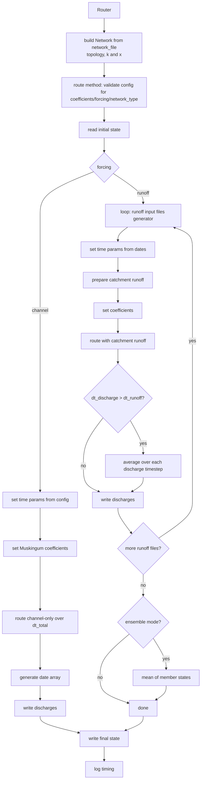

## Routing Lifecycle


```mermaid
graph TD
    A[Router] --> C[build Network from network_file<br/>topology, k and x]
    C --> B[route method: validate config for coefficients/forcing/network_type]
    B --> D[read initial state]
    D --> E{forcing}

    E -->|channel| F[set time params from config]
    F --> G[set Muskingum coefficients]
    G --> H[route channel-only over dt_total]
    H --> I[generate date array]
    I --> J[write discharges]

    E -->|runoff| K[loop: runoff input files generator]
    K --> L[set time params from dates]
    L --> M[prepare catchment runoff]
    M --> N[set coefficients]
    N --> O[route with catchment runoff]
    O --> P{dt_discharge > dt_runoff?}
    P -->|yes| Q[average over each discharge timestep]
    P -->|no| R[write discharges]
    Q --> R
    R --> S{more runoff files?}
    S -->|yes| K
    S -->|no| T{ensemble mode?}
    T -->|yes| U[mean of member states]
    T -->|no| V[done]
    U --> V

    J --> W[write final state]
    V --> W
    W --> X[log timing]
```

A `Router` builds its [`Network`](../api/network.md) from the network file when it is created. The network supplies
the topology and the `k` and `x` vectors, and the routing method chosen by `coefficients` builds its parameters from
them. The network divides its rivers into the blocks threads route the first time it routes with each thread count.
`Router.route()` first validates the required config keys and runoff source for the selected `coefficients`,
`forcing`, `transform`, and `network_type` before any runoff is read. Options no routing method supports yet raise
`NotImplementedError` then. The `Network` and its blocks are built once and reused, so routing repeatedly on one
`Router` reads and partitions the network only once, and each `route()` starts again from `channel_state_init_file`.
When `forcing` is `'channel'`, time parameters are read directly from the config and the channel alone is routed once
over `dt_total`. Otherwise the router loops over the runoff input files (processed sequentially or as an ensemble),
reading `dt_runoff` from each file's dates, routes each one, averages the output over a longer `dt_discharge` when one
is set, and writes the result.

## Finding Inputs and Config Files at Runtime

Instead of manually preparing config files in advance, you may want to generate them in your code which executes the
routing. This is useful when you have a large number of routing runs to perform or if you want to automate the process.
Depending on your preference, you may want to generate many config files in advance or store them for repeatability and
future use.

The following code snippet demonstrates how to identify the essential input arguments and pass them as keyword
arguments to a `Configs`, which is then given to the `Router`. You could alternatively write the inputs to a JSON
file and use that config file instead.

```python
import glob
import os

import river_route as rr

root_dir = '/path/to/root/directory'
region = 'sample-region'

network_file = os.path.join(root_dir, 'configs', region, 'network.parquet')

runoff_files = sorted(glob.glob(f'/path/to/catchment_runoff/directory/*.nc'))

outputs = os.path.join(root_dir, 'outputs', region)
os.makedirs(outputs, exist_ok=True)

configs = rr.Configs(
    forcing='catchment',
    network_file=network_file,
    runoff_files=runoff_files,
    discharge_dir=outputs,
)
m = rr.Router(configs).route()
```

## Customizing Outputs

You can override the default function used by `river-route` when writing routed flows to disk.
The default function, `river_route.router.writers.zarr_writer`, writes each output as a zarr store with dimensions
`(riverId, time)`, built to write as fast as possible. When `Router.route` is given a thread pool and more than one
thread, it writes its chunks concurrently on that pool, rounding each chunk to `writers.ZARR_KEEPBITS` mantissa bits
and compressing it with `writers.ZARR_COMPRESSOR`.

Premade writers are in `river_route.router.writers`. `netcdf_writer` writes the same `(riverId, time)` layout to an
uncompressed netCDF file, with every value unrounded. `discharge_dir` names outputs `discharge_<name>.zarr` for the
default writer, so give any other writer its output paths with `discharge_files`, such as `.nc` paths for
`netcdf_writer`.

```python title="Write Routed Flows to netCDF"
import river_route as rr

(
    rr
    .Router(rr.Configs.from_json('config.json'))
    .set_discharge_writer(rr.router.writers.netcdf_writer)
    .route()
)
```

A zarr store is not ideal for all use cases, so you can override it to store your data how you prefer. Some examples
of reasons you would want to do this include appending the outputs to an existing file, writing values to a
database, or to add metadata or attributes to the file.

Use the `set_discharge_writer` method to supply a custom writer function; it returns the `Router`
so you can chain it onto the constructor. The writer is called once per routed input file, or once for channel
routing, with 5 arguments and 2 keywords:

1. `router`: the `Router` doing the routing, which provides the network as `router.network`, such as
   `router.network.original_river_ids`, the river of each row of `discharge_array`, and the options as
   `router.configs`.
2. `dates`: datetime array for the columns of the discharge array.
3. `discharge_array`: routed discharge array, C-order with shape `(riverId, time)`. The kernels route one river's
   whole series at a time and write it into that river's row, so this is the layout every writer is handed.
4. `discharge_file`: path to the output file.
5. `runoff_file`: path to the runoff input used to produce this output, or `''` for channel routing.
6. `thread_pool`: the thread pool given to `Router.route`, or `None`, for a writer that writes concurrently.
7. `threads`: the thread count given to `Router.route`.

As an example, you might want to write output as Parquet instead. The snippets below focus on the writer; their
configs give the output paths with `discharge_files`, in the format each writer writes.

```python title="Write Routed Flows to Parquet"
import pandas as pd

import river_route as rr


def custom_write_discharges(router, dates, discharge_array, discharge_file, runoff_file, *, thread_pool, threads):
    # discharge_array is (riverId, time), so transpose it for a frame indexed by time
    df = pd.DataFrame(discharge_array.T, index=pd.to_datetime(dates), columns=router.network.original_river_ids)
    df.to_parquet(discharge_file)
    return


(
    rr
    .Router(rr.Configs.from_json('../../examples/config.json'))
    .set_discharge_writer(custom_write_discharges)
    .route()
)
```

```python title="Append Routed Flows to Existing netCDF"
import os

import xarray as xr

import river_route as rr


def append_to_existing_file(router, dates, discharge_array, discharge_file, runoff_file, *, thread_pool, threads):
    ensemble_number = os.path.basename(runoff_file).split('_')[1]
    ds = xr.load_dataset(discharge_file)
    ds['Q'].loc[dict(ensemble=ensemble_number)] = discharge_array
    ds.to_netcdf(discharge_file)
    return


(
    rr
    .Router(rr.Configs.from_json('config.json'))
    .set_discharge_writer(append_to_existing_file)
    .route()
)
```

```python title="Save a Subset of the Routed Flows"
import pandas as pd

import river_route as rr


def save_partial_results(router, dates, discharge_array, discharge_file, runoff_file, *, thread_pool, threads):
    df = pd.DataFrame(discharge_array.T, index=pd.to_datetime(dates), columns=router.network.original_river_ids)
    river_ids_to_save = [1, 2, 3, 4, 5, 6, 7, 8, 9, 10]
    df = df[river_ids_to_save]
    df.to_parquet(discharge_file)
    return


(
    rr
    .Router(rr.Configs.from_json('config.json'))
    .set_discharge_writer(save_partial_results)
    .route()
)
```

## Customizing Runoff Inputs

Routing reads `runoff_files` with the Runoff class for the `forcing`: `CatchmentRunoff` for `catchment`, or
`GridRunoff` for `grid`, which aggregates the grids to catchments with `grid_weights_file`, or `ECMWFGribReducedGrid`
for `ecmwf_grib`. The `Router` builds the one its `forcing` names the first time it routes runoff, and reuses its
weight table for every runoff file.

Runoff in a format or a place this package does not read can be written to netCDF with `Runoff.to_netcdf` and
routed as `runoff_files` with `forcing` catchment. The grid classes precompute that file from their grids with
`aggregate_to_file`, although routing the grids directly is faster: the aggregation then happens inside the routing
kernel. Cumulative runoff, and runoff clipped with `force_positive_runoff`, are the exception: each river needs its
whole series first, so those files are aggregated on one thread before they are routed.
